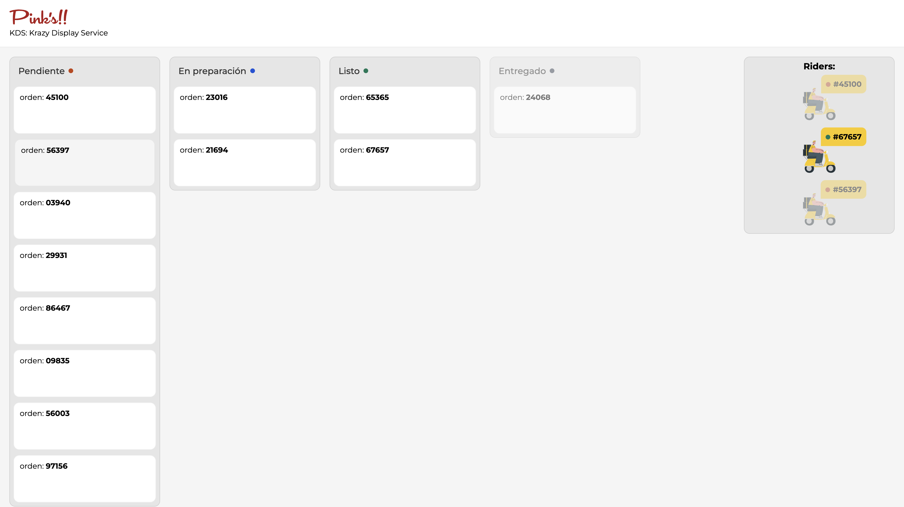

# Pink's KDS: Krazy Display Service Challenge

En este desafío, te enfrentarás a la tarea de gestionar varias órdenes de manera simultánea utilizando tus habilidades y creatividad para resolver un problema único: las órdenes son enviadas a través de Glovo, y necesitamos permitir que nuestro equipo en la tienda opere el Kanban para poder entregar los pedidos a los riders de manera eficiente.

## Descripción del Desafío

Tu objetivo es conectar todo el flujo pero tranquilo! ya tienes medio camino hecho.

Puedes ser tan creativo y extenso como quieras.

## Criterios de Evaluación

Buscamos un Problem solver! se creativo e inteligente pero astuto; mvp first. Primero resuelve el problema, si quieres avanzar con mejoras queda en tu lado!

## Instrucciones para Participar

1. Crea un repositorio en GitHub para tu solución.
2. Desarrolla tu solución teniendo en cuenta los criterios de evaluación mencionados anteriormente.
3. Envía el enlace a tu repositorio a la dirección de correo electrónico indicada en la convocatoria del desafío.

¡Estamos emocionados de ver tu creatividad y habilidades en acción! Buena suerte y que empiece el desafío <3

## Hecho

## 🚀 Funcionalidades

- 1. **Kanban de 4 columnas**: PENDIENTE → EN PREPARACIÓN → LISTO → ENTREGADO
- 2. **Simulación de riders** con animaciones de entrada y salida
- 3. **Interacción con riders**: sólo es posible hacer clic si el pedido está LISTO
- 4  **Drag & drop nativo** entre columnas (excepto "ENTREGADO")
- 5  **Etiquetas con colores** dinámicos por estado
- 6  **SCSS Modules** y animaciones personalizadas
- 7 **React Context API** para manejar el estado global

---

## 📸 Vista previa

